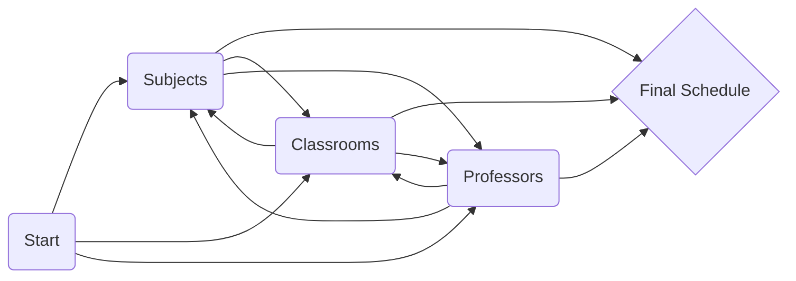

# FINKI CLASS SCHEDULER
## Overview

Python-based class scheduling application implemented using **finite state machine** concept with help of LangGraph. Utilizes several nodes(states) to handle different aspects of scheduling:
- **Subjects**: Manages subject-related information
- **Classrooms**: Handles classroom availability and details
- **Professors**: Manages professor information and availability
- **Final Schedule**: Final state that compiles and prints the generated schedule
> Each element within the system functions as a node in a graph, where its **internal state** is dynamically updated during the **traversal process**. The transitions between these states are governed by predefined **transition probabilities**, analogous to weighted edges in a graph. Routes can be changed in one of the few possible ways shown below, depending on the code.

## Features

1.  Intelligent Scheduling Algorithm:
    -   Sorts subjects by duration for optimal scheduling
    -   Handles both theoretical and practical classes
    -   Assigns professors based on subject expertise
    -   Manages classroom availability
2.  Flexible Time Slot Management:
    -   Supports various time slots throughout the day (8am to 7pm)
    -   Handles all days of the week (Monday to Friday)
3.  Conflict Resolution:
    -   Checks for conflicts in year of listening subjects, classroom availability, and professor availability
    -   Avoids double-booking of resources
4.  Dynamic Schedule Adjustment:
    -   Allows for real-time changes to the schedule from UI
    -   Supports professor and classroom reassignments
5.  Alternative Suggestions:
    -   Recommends alternative professors or classrooms when changes are requested
6.  Weekly Schedule Management:
    -   Maintains a base schedule and a current week schedule
7.  Query Processing:
    -   Interprets natural language queries for schedule changes in Terminal
    -   Extracts relevant information (subject, day, time, change type, etc...) from queries
8.  Constraint Handling:
    -   Respects professor unavailability slots
    -   Considers professor expertise for subject types (theoretical/practical)
9.  Classroom Optimization:
    -   Assigns appropriate classrooms based on availability and subject real-time requirement

 

## Contstraints and Considerations

-   Subject Duration: Respects the specified duration for theoretical and practical classes of each subject.
-   Professor Availability: Considers individual professor schedules and unavailable slots.
-   Classroom Capacity: Ensures classrooms are not double-booked.
-   Subject-Professor Matching: Assigns professors only to subjects they are qualified to teach.
-   Year-of-Study Conflicts: Prevents scheduling conflicts for the same year of study.
-   Weekly Reset: The system can reset to the base schedule at the start of each week.
-   Change Limitations: Some changes may not be possible due to conflicts or classrooms limitations.

  ## Known Issues
While the goal is to provide robust and reliable scheduling system, there are some known limitations and issues:
1. **Classroom Availability Edge Cases**: There's a known bug in fetching available classrooms for certain specific edge cases. This may result in inaccurate classroom suggestions in some scenarios.

If you discover new ones, please report them in the Issues section of this repository.

## Getting Started
The app can be accessed in two modes:
 -  CLI
	 1.  Clone this repository:
	 - `git clone https://github.com/KristijanBoshev/FINKI_Class_Scheduler.git`
	 2. Open the app and install the required dependencies:
	 - `pip install -r requirements.txt`
	 3.  Head into the /app directory and run the main script:
	- `python main.py`
- Cloud Deployment
	This project includes a Streamlit-based user interface for interacting with the Class Scheduling System. The application is deployed on Streamlit Community Cloud, allowing for easy access and use without local setup. You can access the live application at:

	Link: [Class Scheduling System](https://finki-class-scheduler.streamlit.app/)

## Guide
If used in CLI mode, make sure you follow the next format:

 1. For alternative professor:
 - Please suggest alternative professor for < subject > < subject_type> lecture on < day > < time >
 - Example: Please suggest alternative professor for VNP theoretical lecture on Tue 10am
 - And follow the given instructions in Terminal
2. For alternative classroom:
- Please find alternative classroom for < subject > lecture on < day > < time >
- Example: Please find alternative classroom for VNP lecture on Tue 10am	 
- And follow the given instructions in Terminal
